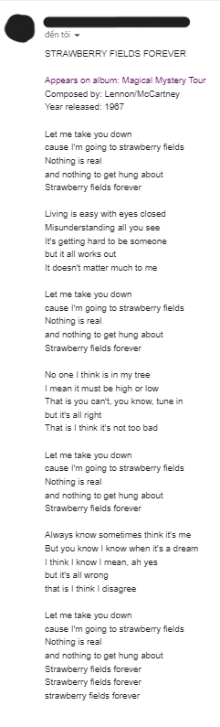

# Daily Beatles Song Email Sender

## Motivation

- Reading lyrics from great lyricists was said to help improve our own songwriting skills. Since Lennon-McCarney is the greatest composer duo (said The Sunday Times in 1963), it would be great for someone like me who loves writing songs to read their songs on a daily basis. 

## Overview

- This python program is a mix between web-scraping and email-sending. We will have a chance to get used to these concepts and their related modules. The required modules are listed in [requirements.txt](requirements.txt).

## Result

## Note

- In order to run this script automatically everyday, we have to use Windows built-in "Task Scheduler" application.